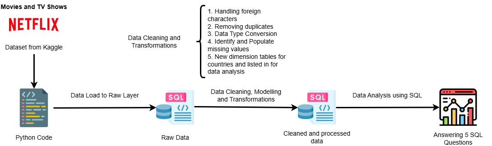

# Netflix Data Engineering & SQL Analysis

## 📌 Project Overview
This project demonstrates an end-to-end data pipeline using **T-SQL** to transform raw Netflix data into a structured relational model. The goal is to showcase advanced SQL proficiency—including data cleaning, schema optimization, and analytical querying—to extract actionable insights from unformatted datasets.

**Dataset Source:** [Netflix Movies and TV Shows (Kaggle)](https://www.kaggle.com/datasets/shivamb/netflix-shows)

---

## 🏗️ Workflow & Architecture
The project follows a professional ETL (Extract, Transform, Load) workflow:

1.  **Ingestion:** Python (Pandas) load from Kaggle to SQL Server (Raw Layer).
2.  **Cleaning:** Handled `NVARCHAR` encoding, removed duplicates via `ROW_NUMBER()`, and performed data type conversion.
3.  **Modeling:** Normalized the dataset into **Dimension Tables** (Genre, Directors, Country, Cast) using `CROSS APPLY` and `STRING_SPLIT` to resolve multi-valued attributes.
4.  **Analysis:** Developed complex queries to solve 5 strategic business questions.

---

## 📁 Repository Structure
* `Data/`: Contains the raw CSV and the Jupyter Notebook for database ingestion.
* `Queries/`: SQL scripts organized by Cleaning, Modeling, and final Analysis.

---

## 📊 Business Insights & SQL Implementation

### 1. Creative Versatility
* **Goal:** Identify directors who have produced both Movies and TV Shows.
* **SQL Technique:** `GROUP BY` + `HAVING COUNT(DISTINCT type) > 1`.

### 2. Genre Dominance by Country
* **Goal:** Find the top country producing "Comedy" movies.
* **SQL Technique:** Multi-table `JOIN` + `TOP 1` filtering.

### 3. Annual Performance Leaders
* **Goal:** Identify the top director by number of releases for every year.
* **SQL Technique:** `CTE` + `ROW_NUMBER()` partitioning by year.

### 4. Content Duration Metrics
* **Goal:** Calculate the average duration of movies per genre.
* **SQL Technique:** String manipulation (`REPLACE`) and numeric casting.

### 5. Genre Crossing Analysis
* **Goal:** List directors who have mastered both "Horror" and "Comedies".
* **SQL Technique:** Relational division using `COUNT(DISTINCT genre) = 2`.

---

## 🛠️ Tech Stack
* **Database:** Microsoft SQL Server (T-SQL)
* **Ingestion:** Python (SQLAlchemy / Pandas)
* **Modeling:** Relational Star Schema approach

---
*Developed as a showcase of SQL Data analytic/Engineering skills.*
